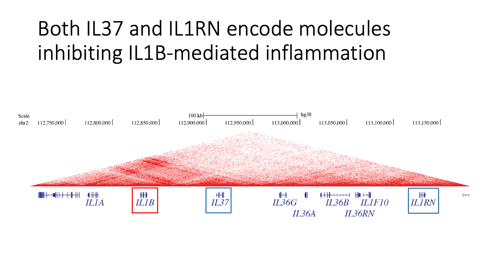

# IL1B_TAD

IL1B Topologically Associated Domain (IL1B TAD) is a 400-kb genomic region consisting of eight IL1B superfamily member genes (see below). Within these genes, IL1A and IL1B encode pro-inflammatory cytokines that trigger an immune response against pathogen infections. On the other hand, IL37 and IL1RN encode molecules that act as inhibitors, dampening the IL1B-mediated inflammation. Interestingly, both IL37 and IL1RN exhibit delayed expression compared to IL1B, which allows the IL1B-mediated immune response to take place during infection. However, the dynamics of expression between the pro-inflammatory genes (IL1B and IL1A) and the anti-inflammatory genes (IL37 and IL1RN) are relatively understudied.

We hypothesize that the IL1B TAD undergoes three-dimensional structural remodeling during infection, which may play a critical role in regulating the expression patterns of these genes. The aim of this project is to investigate and test this hypothesis, shedding light on the intricate mechanisms that govern immune responses during pathogenic infections.

## Technologies Used

- MicroC
- 4C

## Files and Structure

All the data are not opened to public. Members involved in this project could connect to Radboud University high-performance cluster cn45 and check files in the following path:

- `/ceph/rimlsfnwi/data/cellbio/mhlanga/thsieh/microC`
- `/ceph/rimlsfnwi/data/cellbio/mhlanga/thsieh/4C`

In the above path, files are all arranged in similar structure and hosted in the following folders:

- `fastq`: the original raw sequenced files.
- `scripts`: bash scripts.
- `mapped`: sequences mapped to human genome (ver. hg38).

## Protocols

- MicroC: we used a [Dovetail microC kit](./protocol/Rahman%20-%20Dovetail-Micro-C%20Kit-User-Guide-Version-1.2.pdf) for microC. The first stage (cell fixation), however, should be changed to [my customized protocol](./protocol/Fix-cells-for-microC-human-monocytes.pdf) when human primary monocytes are used.
- 4C: we used a protocol modified from [Krijger, et.al 2020](./protocol/Krijger-2020.pdf).

## Scripts

All scripts and codes are open to public. They all hosted in [script repository](./script/).

- Related to MicroC: [QC](./script/qc.sh), [preliminary data process (fastq to bam / pairs)](./script/process.sh), and [final data process (pairs to hic)].
- Related to 4C: [preliminary data process (fastq to bam)](./script/bowtie2.sh), [generate fragment library](./script/fragmentLibrary.R), [generate QC report](./script/4Csummary.R), and [final data process (bam to basic4C objects)](./script/basic4C.R).

## Figures

  

